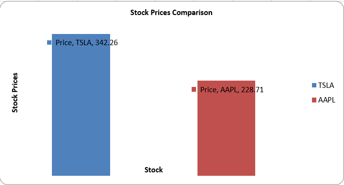

# Stock_Data_Automation


This project automates the extraction, formatting, and visualization of stock data from Yahoo Finance for further data analysis using Python. The tool gathers real-time data for selected stocks, performs basic data transformation and cleaning, and generates visualizations in an Excel report. 

*All you have to do is input your stock ticker and watch as your stock data report is automatically geenrated!!*


## Who This Project is For

This project is designed for:
- **Financial Analysts**: To get a quick snapshot of stock market performance and trends.
- **Investors**: To track the performance of their selected stocks.
- **Data Scientists**: As a foundation for creating advanced financial models.
- **Python Enthusiasts**: To learn about scraping stock data, data cleaning, and visualization using Python.


## Benefits of This Project

- **Automation**: Save time by automating the process of collecting and analyzing stock data.
- **Visualization**: Gain insights through bar charts, column charts, and structured reports.
- **Customizability**: Scrape any stock ticker of your choice.
- **Learning Opportunity**: Provides a modular, Python-based example of combining web scraping, data cleaning, and visualization.


## Features


- Extracts live stock data from Yahoo Finance using web scraping.
- Automate data cleaning and formatting for excel compartibility
- Generates bar charts, scatter plots, and clustered column charts.
- Fully automated workflow for regularly updating stock data and visualizations.


## Prerequisites


- Python 3.x
- Libraries required: **openpyxl**, **pandas**, **requests**, **BeautifulSoup4**.


```bash
pip install -r requirements.txt
```


## Installation


1. **Clone the repository:**


   ```bash
   git clone https://github.com/yourusername/Stock-Data-Automation.git
   ```

3. **Navigate to the project directory**


```bash
cd Stock-Data-Automation
```

3. **Install the required Python package**


```bash
pip install -r requirements.txt
```


## Project Structure


The project  is divided into modular scripts for readability and ease of maintainance, each serving its different purpose:

- **Stock_Ticker.py** : Where your stock data to be scraped are inputed

- **script.py** : Where your stock data is scraped from Yahoo Finance

- **Data_cleaning.py** : Hnadles the cleaning and preprocessing of the stock data

- **Column_chart.py** : Generates a column chart for visualizing stock charts

- **Bar_chart.py** : Creates a bar chart for visualizing P/E ratios
  


### How To Run The Automation


1. **Start with inputing the ticker to scrape**

```bash
python Stock_Ticker.py
```

2. **Ensure that Data_cleaning.py cleans and preprocesses the data before creating visualizations**

3. **Use Column_chart.py and Bar_chart.py to automate visualizations**


## Example Output

Your Column chart should look like this:




Your Bar chart should also look like this:


The stock data report should look this way:


## Use Cases

1. **Portfolio Analysis**: Quickly analyze the performance of multiple stocks in your portfolio.
2. **Market Research**: Use this project as a starting point for analyzing stock trends.
3. **Learning Python**: Learn Python skills like web scraping, pandas data manipulation, and creating charts with `openpyxl`.


## Future Enhancements

1. Add more financial metrics and visualizations

2. Support multiple data sources ( e.g. Trading view, Finviz )


## Challenges Encountered


### 1. Handling Modular Code Execution
- **Challenge**: While creating modular scripts, I faced issues with Python executing unwanted scripts when importing functions (e.g., the `input()` function from the `stock_ticker.py` file running repeatedly).
- **Solution**: I added the `if __name__ == "__main__":` guard to prevent code execution during imports.
- **Takeaway**: This taught me best practices for structuring Python projects and managing module imports effectively.


### 2. Data Cleaning
- **Challenge**: Most of the extracted stock data came as text, making it unreadable in Excel. This prevented me from generating charts or performing further analysis.
- **Solution**: I used the `pandas` library to clean and transform the data into the correct numerical format. I converted text-based fields (e.g., prices, percentages, and volumes) into integers and floats. This allowed the data to be compatible with Excel and visualizations.
- **Takeaway**: I gained valuable experience in data cleaning and learned the importance of ensuring data consistency for analysis and visualization.


### 3. Chart Visualization
- **Challenge**: Initially, my visualizations were unclear and lacked proper labels and legends, making them difficult to interpret.
- **Solution**: I incorporated features like axis labels, data labels, and a descriptive legend to improve the clarity of the charts.
- **Takeaway**: I learned the importance of presenting data visually in a way that is easy to understand.


## License

This project is licensed under the MIT license. See the [LICENSE](LICENSE) file for more details
